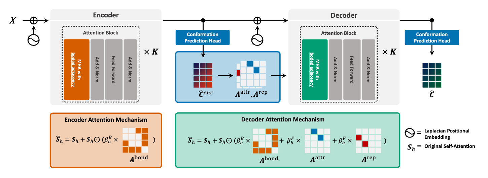

# 🔗 REBIND: Enhancing Ground-state Molecular Conformation Prediction via Force-based Graph Rewiring

The official implementation of the paper **[REBIND](https://openreview.net/forum?id=WNIEr5kydFs) (ICLR 2025)**, By **[Taewon Kim](https://scholar.google.com/citations?user=MzmAf_4AAAAJ&hl=en)**, **[Hyunjin Seo](https://scholar.google.com/citations?user=MFDOhRUAAAAJ&hl=en)**, Sungsoo Ahn, and Eunho Yang (*: equal contribution)

### TL;DR
We present a **novel force-based edge-rewiring framework** for ground-state molecular conformation prediction, mitigating the limitation of prior works which have inadequately addressed non-bonded interactions


### Overview
<div align="center">



</div>

## Environment

### Requirements

* python == 3.10.16
* pytorch == 2.1.0+cu121
* torch-geometric == 2.3.0
* rdkit == 2024.3.3

For the rest of the dependencies, please refer to the [requirements.txt](./requirements.txt).

## Datasets


### official datasets 

The original official datasets can be found at [Molecule3D](https://github.com/divelab/MoleculeX/tree/molx/Molecule3D) and [Qm9](https://figshare.com/collections/Quantum_chemistry_structures_and_properties_of_134_kilo_molecules/978904).

## Experiments
For your conveniecne, we've added a `run.py` file. The details for each steps are specified below.


### Training

```bash
bash experiments/conformer_prediction/rebind.sh [device number]
```

### Evaluation
```python
python -m evaluate \
  --data_dir datasets/ \
  --dataset QM9 \
  --mode random \
  --split test \
  --log_file logs/[log file name] \
  --REBIND_checkpoint [trained ckpt] \
  --device cuda:{args.device} \
  --removeHs
```

We provide model weights for QM9: [REBIND_QM9](https://drive.google.com/drive/folders/1yJLqdEyFFiijkmeZc2rzR2YiR7uy5qE3)

## Citation

Please cite our paper if you find our work useful for your research:

```bibtex
@article{kim2024rebind,
  title={REBIND: Enhancing ground-state molecular conformation via force-based graph rewiring},
  author={Kim, Taewon and Seo, Hyunjin and Ahn, Sungsoo and Yang, Eunho},
  journal={arXiv preprint arXiv:2410.14696},
  year={2024}
}
```

### Acknowledgements
Our codebase is based upon the works of [GTMGC](https://openreview.net/forum?id=F7QnIKlC1N&noteId=F7QnIKlC1N). We thank the authors for releasing their code.

